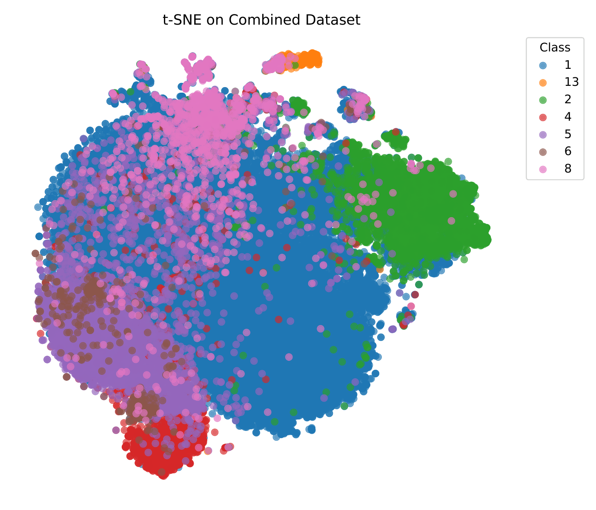
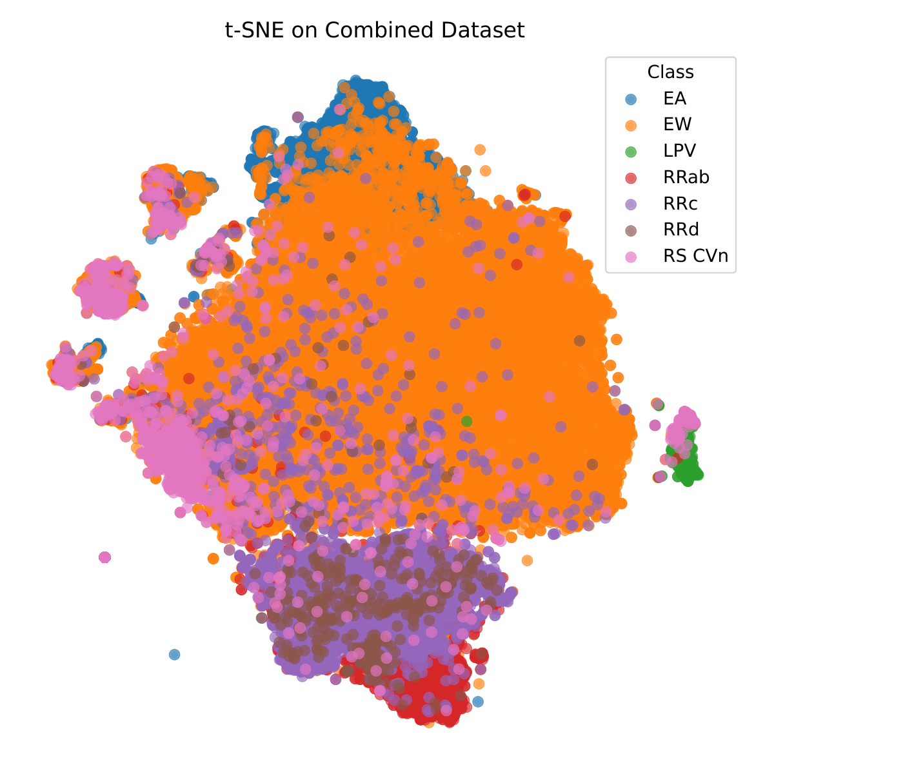
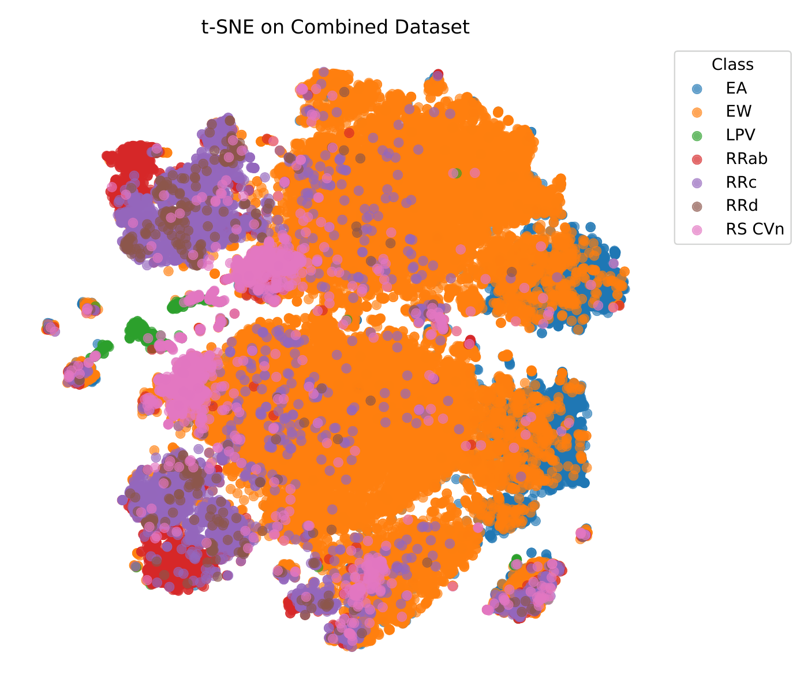

# Results Comparison

## Classification Results

| Classifier | Metric | Astromer-1 | Astromer-2 | Moirai-small | Chronos-tiny | Chronos-Bolt | Random | HF | agentic(Gemini-3.1-pro) | kimi(Kimi-2.5) |
| :--- | :--- | :--- | :--- | :--- | :--- | :--- | :--- | :--- | :--- | :--- |
| *k*-NN | Accuracy | 0.644 | 0.823 | 0.809 | <u>0.857</u> | 0.807 | 0.648 | **0.881** | 0.901 | 0.854 |
| | Precision | 0.130 | 0.660 | 0.662 | <u>0.799</u> | 0.647 | 0.120 | **0.818** | 0.825 | 0.736 |
| | Recall | 0.141 | 0.489 | 0.509 | <u>0.623</u> | 0.542 | 0.140 | **0.661** | 0.720 | 0.614 |
| | F1 | 0.122 | 0.537 | 0.554 | <u>0.672</u> | 0.570 | 0.120 | **0.712** | 0.761 | 0.648 |
| logistic | Accuracy | 0.073 | 0.648 | 0.705 | <u>0.750</u> | 0.709 | 0.094 | **0.838** | 0.883 | 0.819 |
| | Precision | 0.147 | 0.486 | 0.544 | <u>0.575</u> | 0.549 | 0.144 | **0.663** | 0.720 | 0.598 |
| | Recall | 0.165 | 0.668 | 0.680 | <u>0.730</u> | 0.676 | 0.128 | **0.854** | 0.866 | 0.826 |
| | F1 | 0.072 | 0.521 | 0.579 | <u>0.617</u> | 0.580 | 0.076 | **0.714** | 0.764 | 0.644 |
| RF | Accuracy | 0.676 (0.000) | 0.846 (0.000) | 0.823 (0.001) | <u>0.862 (0.000)</u> | 0.826 (0.001) | 0.676 (0.000) | **0.920 (0.001)** | 0.948 | 0.916 (0.000) |
| | Precision | 0.111 (0.043) | <u>0.799 (0.006)</u> | 0.716 (0.007) | 0.750 (0.056) | 0.707 (0.002) | 0.097 (0.000) | **0.866 (0.003)** | 0.915 | 0.870 (0.000) |
| | Recall | 0.143 (0.000) | 0.526 (0.002) | 0.514 (0.002) | <u>0.597 (0.002)</u> | 0.548 (0.001) | 0.143 (0.000) | **0.773 (0.004)** | 0.812 | 0.730 (0.001) |
| | F1 | 0.115 (0.000) | 0.580 (0.002) | 0.557 (0.002) | <u>0.638 (0.002)</u> | 0.582 (0.001) | 0.115 (0.000) | **0.804 (0.003)** | 0.842 | 0.777 (0.001) |
| MLP | Accuracy | 0.446 (0.147) | 0.627 (0.037) | 0.717 (0.031) | <u>0.783 (0.022)</u> | 0.721 (0.022) | 0.308 (0.203) | **0.833 (0.022)** | 0.860 | 0.841 (0.022) |
| | Precision | 0.154 (0.006) | 0.453 (0.019) | 0.546 (0.022) | <u>0.589 (0.025)</u> | 0.553 (0.026) | 0.137 (0.006) | **0.672 (0.025)** | 0.688 | 0.642 (0.025) |
| | Recall | 0.165 (0.003) | 0.627 (0.020) | 0.722 (0.006) | <u>0.758 (0.006)</u> | 0.696 (0.013) | 0.145 (0.002) | **0.851 (0.009)** | 0.864 | 0.815 (0.009) |
| | F1 | 0.138 (0.020) | 0.470 (0.023) | 0.594 (0.019) | <u>0.643 (0.023)</u> | 0.589 (0.015) | 0.094 (0.044) | **0.723 (0.027)** | 0.746 | 0.680 (0.027) |

# Clustering Results

| Methods | K-means NMI | K-means ARI | K-means F1 | Ward NMI | Ward ARI | Ward F1 |
| :--- | :--- | :--- | :--- | :--- | :--- | :--- |
| **Astromer-1** | 0.0041 (0.0001) | 0.0017 (0.0011) | 0.1660 (0.0014) | 0.0041 | 0.0001 | 0.1652 |
| **Astromer-2** | 0.0082 (0.0010) | 0.0192 (0.0078) | 0.1590 (0.0042) | 0.0091 | 0.0310 | 0.1600 |
| **Moirai-small** | 0.1749 (0.0017) | 0.0981 (0.0028) | 0.2831 (0.0034) | 0.1476 | 0.0828 | 0.2612 |
| **Chronos-tiny** | <u>0.2374 (0.0082)</u> | **0.1596 (0.0029)** | 0.3110 (0.0362) | 0.1890 | 0.1217 | **0.3671** |
| **Chronos-Bolt-tiny** | 0.2120 (0.0033) | <u>0.1306 (0.0125)</u> | <u>0.3128 (0.0027)</u> | <u>0.2273</u> | **0.1553** | <u>0.3662</u> |
| **Random Embeddings** | 0.0003 (0.0001) | 0.0000 (0.0000) | 0.0977 (0.0007) | 0.0003 | 0.0004 | 0.1122 |
| **Hand-crafted Features** | **0.2700 (0.00058)** | 0.1197 (0.00092) | **0.3960 (0.0271)** | **0.2508** | <u>0.1319</u> | 0.3323 |
| **agentic(Gemini-pro)** | 0.0781 | 0.0320 | 0.2730 | 0.0274 | 0.0154 | 0.1762 |
| **kimi(Kimi-2.5)** | 0.2380 | 0.1486 | 0.3673 | 0.3797 | 0.2783 | 0.3244 |

---

## All Classifiers Confusion Matrices (4x3 Grid Comparison)

Below is the exact side-by-side comparison across all **8,300 test stars** for all four classifiers (`RF`, `k-NN`, `MLP`, `Logistic Regression`).
The Handcrafted Feature (HF) baseline matrices are exact values taken from Figure 10 of the published paper (`2510.06200v3.pdf`). 
The `kimi` (Kimi-2.5) and `agentic` (Gemini-3.1-pro) matrices are the exact **3-seed expected average** (`[42, 100, 200]`) on the local test set.

### 📊 Visual Heatmaps

## Clustering t-SNE Graphs (Side-by-Side Comparison)

Comparison of unsupervised feature space separation across all **41,492 variable stars** in the combined dataset.

| Feature Suite / Model | t-SNE Projection Preview |
| :--- | :---: |
| **Hand-crafted Features (Baseline)** |  |
| **kimi (Kimi-2.5 — 102 Features)** |  |
| **agentic (Gemini-3.1-pro — 222 Features)** |  |

